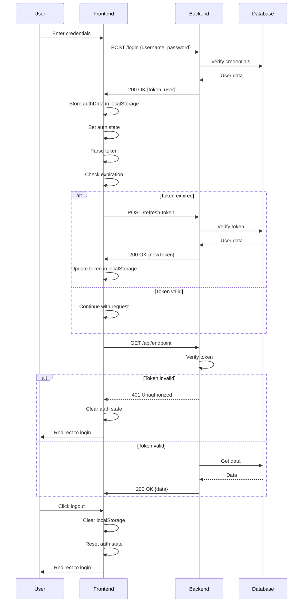

```markdown
# Token Flow

This document outlines the token-based authentication flow implemented in the Mobile Budget App, ensuring secure and seamless user sessions.

## Authentication Flow

### Initial Login

The process begins with user authentication:

1. **User Input**: The user enters their credentials (username and password).
2. **Frontend Request**: The frontend sends a `POST /login` request to the backend with the credentials.
3. **Backend Verification**: The backend verifies the credentials with the database.
4. **Response Handling**:
    - On success, the backend responds with a token and user data.
    - The frontend stores the authentication data in `localStorage` and sets the authentication state.

### Token Validation

The app ensures token validity before making API requests:

1. **Token Parsing**: The frontend parses the token and checks its expiration.
2. **Expiration Handling**:
    - **If expired**:
      - The frontend sends a `POST /refresh-token` request to the backend.
      - The backend verifies the token with the database and issues a new token.
      - The frontend updates the token in `localStorage`.
    - **If valid**:
      - The frontend proceeds with the request.

### API Request

The app uses the token for secure API communication:

1. **Request Initiation**: The frontend sends an authenticated request (e.g., `GET /api/endpoint`) to the backend.
2. **Token Verification**:
    - **If invalid**:
      - The backend responds with `401 Unauthorized`.
      - The frontend clears the authentication state and redirects the user to the login page.
    - **If valid**:
      - The backend retrieves the required data from the database and responds with the data.

### Logout

The user can log out to terminate the session:

1. **User Action**: The user clicks the logout button.
2. **Frontend Cleanup**:
    - Clears `localStorage`.
    - Resets the authentication state.
    - Redirects the user to the login page.

## Sequence Diagram

The following sequence diagram illustrates the token flow:


```
